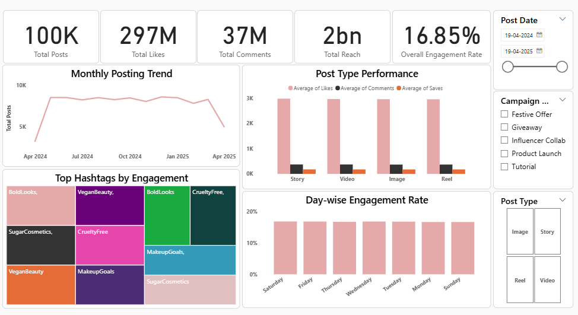

# 💄 Sugar Cosmetics Instagram Analytics

## 📊 Project Overview

This project analyzes Instagram performance data of Sugar Cosmetics to understand audience engagement, content effectiveness, and marketing strategy.

The goal is to convert raw social media data into actionable insights that can improve engagement, optimize content strategy, and enhance brand performance.

---

## ❓ Problem Statement

To identify key patterns in Instagram engagement and answer:

- Which content type performs best?
- How effective is the current posting strategy?
- Why is high reach not converting into engagement?
- How can the hashtag strategy be optimized?

---

## 🛠️ Tools Used

- Power BI (Dashboard & Visualization)
- Excel (Data Cleaning & Preparation)

---

## 📈 Key Metrics

- Total Impressions: **3 Billion**
- Total Reach: **2 Billion**
- Total Likes: **297 Million**
- Total Comments: **37 Million**
- Total Saves: **18 Million**
- Total Shares: **16 Million**
- Followers: **18 Million**
- Engagement Rate: **16.85%**
- Total Posts: **100K**

---

## 📊 Dashboard Preview



---

## 🔍 Key Insights

### 🎥 Content Performance
- Reels generate the highest engagement across likes, comments, and saves
- Videos and images perform moderately well
- Stories have the lowest engagement and are better suited for retention/CTA

---

### 📅 Posting Trends
- Engagement is consistent across all days of the week
- Posting frequency is driven by marketing campaigns rather than specific days

---

### ⚠️ Reach vs Engagement Gap
- Despite massive reach (3B impressions), engagement conversion is only **~0.7%**
- Indicates strong visibility but weak audience interaction

---

### 🏷️ Hashtag Insights
- High-performing hashtags: **#BoldLooks, #VeganBeauty**
- Low-performing (overused): **#SugarCosmetics, #CrueltyFree**
- Optimization opportunity exists in hashtag selection

---

## 💡 Business Recommendations

- 🎯 Focus more on Reels for maximum engagement
- 🎬 Improve hooks in the first 3 seconds of content
- 📝 Add stronger CTAs in captions
- 🏷️ Optimize hashtag strategy using high-performing tags
- 🔁 Replicate high-performing posts and campaigns

---

## 📂 Repository Structure

```text
Sugar-Cosmetics-Instagram-Analysis
│
├── dataset.xlsx
├── dashboard.png
├── presentation.pptx
└── README.md
```

---

## 📌 Conclusion

This project highlights how high visibility does not always translate into engagement.

By leveraging data-driven insights, brands can improve content strategy, increase audience interaction, and maximize marketing effectiveness.

---

## 🚀 Key Learnings

- Social media data analysis
- Engagement metrics interpretation
- Content strategy optimization
- Dashboard storytelling using Power BI
